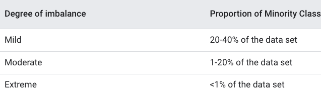
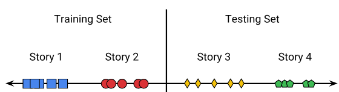
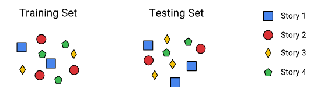
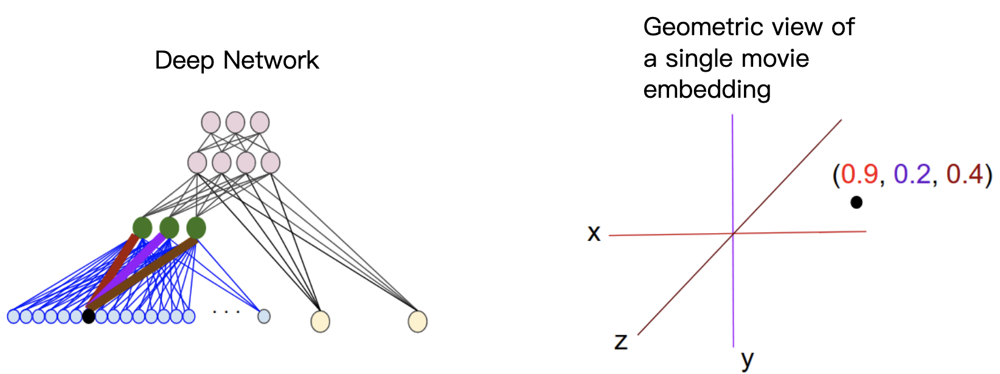
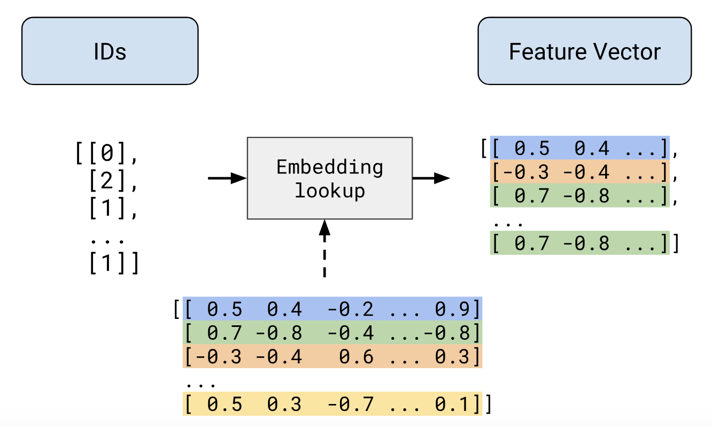

# Feature Engineering
why feature engineering?
- We need good data so that model learns the right thing and makes good prediction.

construct dataset
- step
    - collect raw data
    - feature and label
    - sampling method
    - split data
- Data collection pipline
    - starts with few features to establishes baseline

# Transform data

We need good data so that model can find pattern in those data easily.

Before we train model, we have to construct and transform dataset
- construct
    - split data
    - sample
    - collect
    - make feature/label
- transform
    - clean
    - feature engineering
        - def: create feature from multiple sources
why transform data?
- matrix multiplication has fix input and operate on numeric. thus we need:
    1. convert string to numeric value
    2. resize input feature
- other purpose:
    1. express nonlinearity in linear model
        - b/c nonlinear model like neural network takes a lot of computation to train
    2. normalize the data
        - b/c gradient descent won't bounce around and converge quickly
    3. lower casing
        - b/c turn letters into upper case shouldn't affect prediction

transform data before training
- pro
    - compute once
    - easy to lookup entire dataset
- con
    - skew data for online/offline serving
        - e.g. you can't find the vocabulary, which was built in offline for online feature
    - slow iteration
        - have to change every data at once rather than on demand

transform data within training
- pro
    - transformation is the same for online and offline
    - Source files can be reused even if you need a different transformation
- con
    - model latency increases

Before we transform data, explore the data a bit
1. visualize it
2. check statistic

ways to transform data
1. normalize
2. bucketing

we normalize the data b/c
1. gradient descent converges quickly and doesn't bounce around
2. feature with wide range makes model return NAN in gradient descent

There are many types of normalization which compress the range of the dataset
- scale to a range
    - eq
    $$
        x^{'}\ = {x-x_{min} \over x_{max}-x_{min}}
    $$
    - when data are distributed evenly
        - e.g. age
        - not good for income
- log scaling
    - eq
    $$
        x^{'}\ = \log(x)
    $$
    - when data are distributed according to power law
- feature clipping
    - eq
    $$
        \begin{align}
            x = min(x, upper_bound) \\
            x = max(x, lower_bound)
        \end{align}
    $$
    - when many outliers are far from majority of the data
- z scale
    - turn mean to zero and make deviation 1
    - eq
        $$
            x^{'} = {x-\mu \over \sigma}\\
        $$
        - where
            - $\sigma$: std, standard deviation
            - $\mu$: mean

    - when data has few outlier and follow normal distribution

Bucketing
- given a set of threshold, convert numeric value to category data
    - fix space bucket
        - divide value into equal range
    - quantile bucket
        - each bucket has the same number of point
        - some buckets may have wider span

Category feature has discrete value. We usually assign a category to a numeric based on mapping

One hot encoding represent category feature with binary vector so that model doesn't spend time on learning order and numeric relationship from the category
- e.g. postal code 240 have no meaningful relationship with code 241

out of volcabulary
- a bucket that holds category that are not on the mapping

use hash to create vocabulary
- pro: don't have to select vocabulary for large distribution
- con: hash collision, two category may have nothing in common but are put into the same category

hybrid approach(vocabulary + hashing)
- build up vocabulary for common data
- use hashing for data that keep changing

# Randomization
flaw of random split
- Model learns from information that is not available at prediction time

Split data by time
- By having latest data as testing and evaluation set, we simulate online behavior of the data
- e.g.
    1. collect 30 days of data
    2. model was trained on 1-29 days of data
    3. evaluate data on 30 day

the data you generate should be deterministic
1. random number generator(RNGs)
    - given seed, same values are generated in the same order
2. hash value
    - hash function output won't change given the same input

Problem with hash
- Either include or exclude the data from training. Data that are included in evaluation set may be seen in prediction time, thus we need to add date to the key. This add diversity to our trainning split.

# Imbalanced Data

imbalanced
- data set with skew class proportions

majority class
- data are localized in few class

minority class
- class has few dta

degree of imbalance
- determines sampling strategy by how much data is skewed.

problem with imbalance
- In a batch, model learn from majority class and didn't make progress while gradient descends.

downsampling
- take a small subset of majority class for training

upweighting
- add weight which is equal to downsampling factor
- example weight = original example weight * downsamping factor

why upweighting and downsampling
- save more disk space for minority class
- model quickly converges
- output is calibrated to reflect probability

clustered data
- examples group by certain attribute
- e.g. similar news topics happen around the same time

split data by time
- it prevents overlap(skew of class) of training/testing set
- good for classifying news
- works for large dataset

Note that domain knowledge helps to split your data
- grouping the data in the wrong way introduces skew in dataset and provide info that is not available at serve time

# Collecting Data

"Garbage in, garbage out" applies to ML.
- how to measure quality of data?
- how much data do you need?

Examples are more than training parameters.
- It's best to train simple model with the large dataset.

quality
- reliability
    - filter
        - e.g. include queries from bot for spam detection
    - noise
        - e.g. fluctuation in thermostat
    - label errors
        - e.g. human labels data incorrectly.
- feature representation
    - handle outlier
    - normalization
    - extract useful feature
- minimun skew
    - your training set should be representative of your serving traffic.
    - e.g. training/serving skew

join data logs
- combine data from multiple sources

type of logs
- transactional log
    - an event with who, when what
- attribute data
    - aren't tied to specific event
    - created by aggregation of transactional logs
    - e.g. demographic, history at a time, user churn, etc.
- aggregate statistics
    - create statistical attribute from multiple transactional logs
    - e.g. average click rate on ads, frequency of user queries

online vs offline
- latency should be low for online
    - looking up attribute data from external system increases latency
    - calculating statistic before serving can computational expensive

direct label for event
- label user's behavior in event
- e.g. log impression as well as click through to measure the effects of top search results.

direct label for attribute
- prediction that occurs for a period of time
- e.g. use two weeks clicking data for a batch to learn effects of weekend on predictions.

logs from history
- machine learning predicts future based on things in the past.

if you don't have data
- human label data
    - Note that human introduces error. Try to label it yourself and see if it makes sense.
- heuristic data
- brought data from similar problems

categorical feature
- discrete values where you can't extract meaning by comparing them
    - e.g. breeds of dogs
- use integer over numerical for category
- ways
    - unique feature for each category

volcabulary
- a value(index number) that maps to category
- use feature vector to present category in example
    - e.g.
        - friday feature vector = [0,0,0,0,1,0,0]
        - sparse vector  [4]
            - this saves spaces.

out of volca(OOV)
- for feature that can't be categorized
    - e.g. an eccentric color of a car

hash for category
- pro
    - data that changes constantly
    - less manual efforts to categorize data
- con
    - two examples don't share anything but are put in the same category due to collision

hybrid of hash and volcabular
- apply hash to OOV and put it in hash buckets

generate feature vector with embedded
- category feature which is presented as continuous value feature
    - e.g. put a category in a feature space
- value is part of the model
